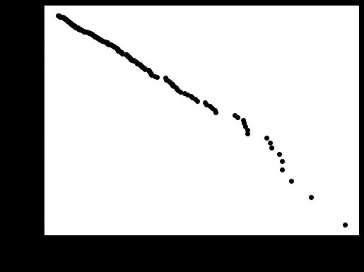

Flare Frequency Distributions and Power Laws
=====

Once you have found all the flares, you can compute statistical measures using your flare table. 

The `ffd` module allows you to compute Flare Frequency Distributions. You can use it to

- fit the power law exponent :math:`\alpha` and intercept :math:`\beta`, 
- plot the resulting function in the cumulative form,
- test if the power law assumption must be rejected, 
- and if the distribution is truncated at the high energy end.

Furthermore, you can make use of the ``ed_corr``, ``recovery_probability`` attributes of the flares in the flare table that you may obtain from performing *injection and recovery of synthetic flares*.

Finally, if your flare table contains contributions from multiple stars that you think generate flares that can be described by the same power law but with different detection thresholds, you can use the `mutliple_stars` keyword to account for this. 

*Note that samples with less than 100-200 flares are to be analysed with caution.*

Example
-------

You can directly use the ``FlareLightCurve.flares`` table, or any ``pandas.DataFrame``_ where the recovered flare energies column is named ``ed_rec``.

Assume we have such a ``FlareLightCurve`` called ``flc`` with the required attribute ``flc.flares``, we can create a FFD object 

::

    from altaipony.ffd import FFD
    simple_ffd = FFD(f=flc.flares)

``simple_ffd.f`` contains the table with the energies of the flares. We can also specify the observing time it took to detect the event listed in the table:

::

    simple_ffd.tot_obs_time = 20.
    
The unit is your choice, and you should know which one you are using. If you do not specify ``tot_obs_time``, the FFD frequencies will instead be the number counts, i.e. ``simple_ffd.tot_obs_time=1.``.

The core method in FFD is ``ed_and_freq``. It gives you the sorted array of energies, their corresponding frequencies, and number counts for each event with a certain energy, suitable for plotting:

::

    import matplotlib.pyplot as plt
    ed, freq, counts = simple_ffd.ed_and_freq()
    plt.figure(figsize=(8, 6))
    plt.scatter(ed, freq, c="k")
    plt.xscale("log")
    plt.yscale("log")
    plt.xlabel("ED [s]")
    plt.ylabel("cumulative number of flares per time");
    
    

  
Let's attempt to fit a power law to this distribution. We use a Maximum Likelihood Estimator approach detailed in Maschberger and Kroupa (2009)[1]_ to find the slope :math:`\alpha` and then do a simple least squares fit to estimate the intercept :math:`\beta`:

::

    simple_ffd.fit_powerlaw()
    simple_ffd.fit_beta_to_powerlaw()
    

The results can be accessed with `simple_ffd.alpha`, `simple_ffd.alpha_err`, `simple_ffd.beta`, and `simple_ffd.beta_err`, respectively.

Use `plot_powerlaw` to plot the result on top of the FFD with the code snippet below:

::

    fig, ax = plt.subplots(1, figsize=(8,6))
    ax.scatter(ed, freq, c="k")
    ax.set_xscale("log")
    ax.set_yscale("log")
    ax.set_xlabel("ED [s]")
    ax.set_ylabel("cumulative number of flares per time")
    simple_ffd.plot_powerlaw(ax, c="r", label=fr'$\alpha=$-{simple_ffd.alpha:.1f}')
    plt.legend();

.. image:: powerlaw.jpg
  :width: 400
  :alt: a simple FFD

.. rubric:: Footnotes

.. [1] Thomas Maschberger, Pavel Kroupa, Estimators for the exponent and upper limit, and goodness-of-fit tests for (truncated) power-law distributions, Monthly Notices of the Royal Astronomical Society, Volume 395, Issue 2, May 2009, Pages 931–942, https://doi.org/10.1111/j.1365-2966.2009.14577.x
  
  
  .. _``pandas.DataFrame``: https://pandas.pydata.org/pandas-docs/stable/reference/api/pandas.DataFrame.html
