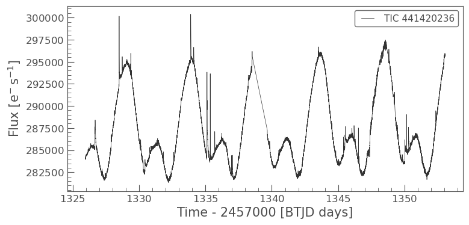
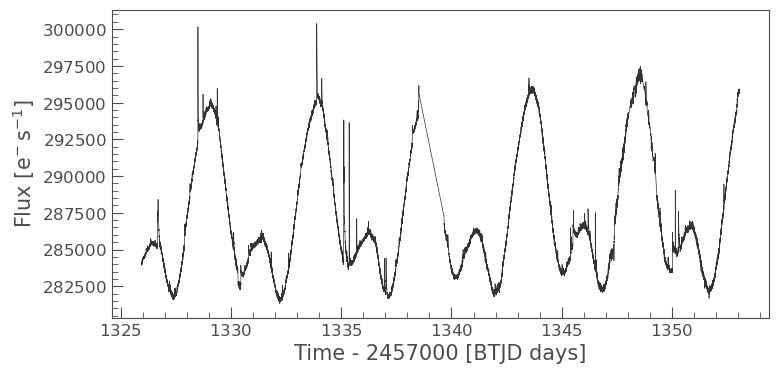
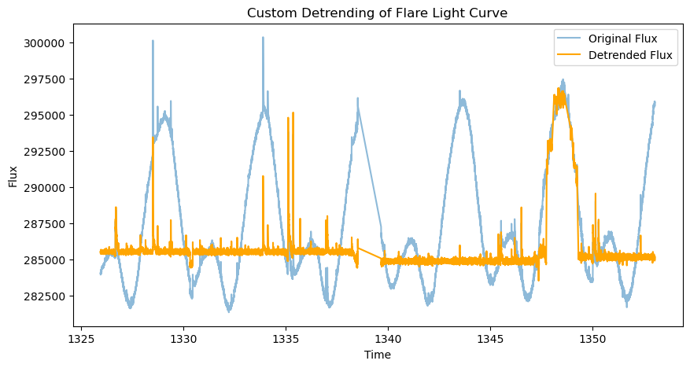
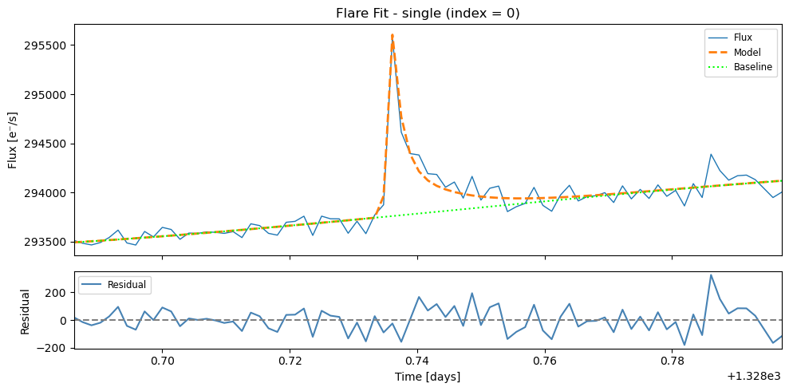
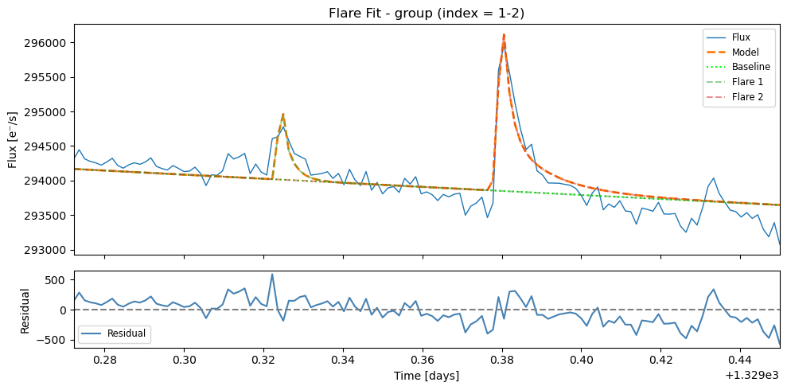

Quickstart AltaiPony: De-trend and find flares
==============================================

``AltaiPony`` works off of the ``lightkurve`` package, with a
``FlareLightCurve`` being a subclass of the more general ``LightCurve``.
So, to get started with ``AltaiPony``, you first want to get a light
curve via ``lightkurve``.

.. code:: ipython3

    import lightkurve as lk
    
    from altaipony.customdetrend import custom_detrending
    from altaipony.lcio import to_flare_lightcurve
    
    import matplotlib.pyplot as plt

Let’s start by searching for AU Mic, a young, active star, observed with
TESS with ``search_lightkurve``. (Consult the docs of ``lightkurve`` for
the various parameters.)

.. code:: ipython3

    # get a table of light curves from MAST
    lc_table = lk.search_lightcurve('AU Mic', mission='TESS', author='SPOC')
    
    lc_table

.. csv-table:: TESS Observations
   :header: "#", "Mission", "Year", "Author", "Exptime (s)", "Target Name", "Distance (arcsec)"
   :widths: 5, 15, 8, 10, 12, 15, 15
   :class: small-table
   
   0, TESS Sector 01, 2018, SPOC, 120, 441420236, 0.0
   1, TESS Sector 27, 2020, SPOC, 20, 441420236, 0.0
   2, TESS Sector 27, 2020, SPOC, 120, 441420236, 0.0
   3, TESS Sector 95, 2025, SPOC, 20, 441420236, 0.0
   4, TESS Sector 95, 2025, SPOC, 120, 441420236, 0.0

Let take the first on the list, download it and plot it:

.. code:: ipython3

    %matplotlib inline
    lc = lc_table[0].download()
    lc.plot();

.. parsed-literal::

    5% (982/19261) of the cadences will be ignored due to the quality mask (quality_bitmask=175).
    5% (982/19261) of the cadences will be ignored due to the quality mask (quality_bitmask=175).

We can immediately see that there are some flares (bursty positive
excursions). Now let’s make ``lc`` a FlareLightCurve object using the
``to_flarelightcurve`` function:

.. code:: ipython3

    flc = to_flare_lightcurve(lc)
    flc.plot();

Note that this preserves the functions that you are used to from
``lightcurve``, such as ``plot()``. Nifty.

Let’s check what’s changed:

.. code:: ipython3

    flc

.. raw:: html

    <pre>FlareLightCurve(ID: 441420236 | Mission: TESS   | QCS:   1 | Cadence: 120 s</pre>

The above tells us that we have indeed created a ``FlareLightCurve``,
and it still has all the attributes, plus some more, like an empty flare
table, and an empty detrended flux column.

This is the raw light curve. The is intrumental noise but also stellar
variability. Let’s remove it with K2SC:

.. code:: ipython3

    flcd = flc.detrend("custom", func=custom_detrending, spline_coarseness=8)
    
    plt.figure(figsize=(10, 5))
    plt.plot(flc.time.value, flc.flux, label='Original Flux', alpha=0.5)
    
    plt.plot(flcd.time.value, flcd.detrended_flux, label='Detrended Flux', color='orange')
    plt.xlabel('Time')
    plt.ylabel('Flux')
    plt.title('Custom Detrending of Flare Light Curve')
    plt.legend();

.. code:: ipython3

    import astropy.units as u
    
    flcd = flcd.find_flares()
    flcd.flares.sort_values(by="ed_rec", ascending=False)

.. parsed-literal::

    Found 41 candidate(s) in the (0,8949) gap.
    Found 28 candidate(s) in the (8949,14785) gap.
    Found 3 candidate(s) in the (14785,14973) gap.
    Found 12 candidate(s) in the (14973,17693) gap.

.. csv-table:: Flare Table
   :header: "Index", "istart", "istop", "cstart", "cstop", "tstart", "tstop", "ed_rec", "ed_rec_err", "ampl_rec", "dur", "n_valid"
   :widths: 5, 7, 7, 7, 7, 10, 10, 10, 10, 10, 8, 7
   :class: small-table
   
   72, 14974, 15060, 87456, 87732, 1348.927, 1349.311, 802.47, 0.707, 0.03181, 0.383, 17693
   68, 14631, 14784, 86616, 86794, 1347.761, 1348.008, 581.10, 0.357, 0.02975, 0.247, 17693
   30, 6517, 6634, 77508, 77625, 1335.111, 1335.274, 93.41, 0.183, 0.03255, 0.162, 17693
   65, 14426, 14604, 86350, 86568, 1347.391, 1347.694, 57.61, 0.389, 0.00548, 0.303, 17693
   0, 521, 614, 71430, 71525, 1326.669, 1326.801, 46.93, 0.207, 0.01085, 0.132, 17693
   ..., ..., ..., ..., ..., ..., ..., ..., ..., ..., ..., ...
   35, 7536, 7539, 78537, 78540, 1336.540, 1336.544, 0.304, 0.042, 0.00110, 0.004, 17693
   61, 14233, 14236, 86142, 86145, 1347.102, 1347.107, 0.295, 0.043, 0.00089, 0.004, 17693
   6, 1450, 1453, 72374, 72377, 1327.981, 1327.985, 0.284, 0.043, 0.00096, 0.004, 17693
   78, 15921, 15924, 88623, 88626, 1350.548, 1350.552, 0.280, 0.043, 0.00092, 0.004, 17693
   55, 13337, 13340, 85232, 85235, 1345.839, 1345.843, 0.262, 0.043, 0.00087, 0.004, 17693

**Column Descriptions**

- **istart/istop**: Start/stop indices in the original flux array
- **cstart/cstop**: Start/stop indices in the cadence array
- **tstart/tstop**: Start/stop times in BKJD or BTJD
- **ed_rec**: Recovered equivalent duration (ED)
- **ed_rec_err**: Error in recovered ED
- **ampl_rec**: Recovered amplitude in relative flux units
- **dur**: Duration of flare in days
- **n_valid**: Total number of valid data points in light curve

.. code:: ipython3

    flcd.flares = flcd.flares.iloc[10:13]  # Keep only 3 medium sized flares to showcase fitting
    flcd.flares

.. csv-table:: Selected flares
   :header: "Index", "istart", "istop", "cstart", "cstop", "tstart", "tstop", "ed_rec", "ed_rec_err", "ampl_rec", "dur", "n_valid"
   :widths: 5, 7, 7, 7, 7, 10, 10, 10, 10, 10, 8, 7
   :class: small-table
   
   10, 1993, 2001, 72918, 72926, 1328.736, 1328.747, 2.13, 0.057, 0.00631, 0.011, 17693
   11, 2410, 2417, 73340, 73347, 1329.322, 1329.332, 1.35, 0.064, 0.00248, 0.010, 17693
   12, 2451, 2465, 73381, 73396, 1329.379, 1329.400, 5.19, 0.077, 0.00771, 0.021, 17693

This flare table gives a first impression of where the flares are found,
and what their properties are. To get a better estimate, you can fit a
flare template to each detection using ``fit_flares()``, which follows
the procedure described in `Guenther et
al. (2020) <https://ui.adsabs.harvard.edu/abs/2020AJ....159...60G>`__:

.. code:: ipython3

    flcd.fit_flares(max_flares=3, plot=True, n_steps=1500, discard=100)

.. parsed-literal::

    
     Fitting region from 1328.68612 to 1328.79723; Region [0](max. number of flares in group = 3 x 1)

.. parsed-literal::

      0%|          | 0/1500 [00:00<?, ?it/s]100%|██████████| 1500/1500 [00:49<00:00, 30.40it/s]
    100%|██████████| 1500/1500 [00:42<00:00, 35.19it/s]
    100%|██████████| 1500/1500 [00:38<00:00, 39.27it/s]

.. parsed-literal::

    
     Fitting region from 1329.27222 to 1329.45000; Region [1](max. number of flares in group = 3 x 2)

.. parsed-literal::

    100%|██████████| 1500/1500 [00:47<00:00, 31.43it/s]
    100%|██████████| 1500/1500 [00:50<00:00, 29.55it/s]
    100%|██████████| 1500/1500 [00:55<00:00, 26.90it/s]
    100%|██████████| 1500/1500 [00:51<00:00, 29.27it/s]
    100%|██████████| 1500/1500 [00:52<00:00, 28.52it/s]
    100%|██████████| 1500/1500 [00:56<00:00, 26.60it/s]

.. code:: ipython3

    flcd.flare_table()

.. csv-table:: Selected Flare Fits
   :header: "Index", "t_peak", "t_peak_err", "fwhm", "fwhm_err", "amplitude", "amplitude_err", "ed_rec", "fit_type", "group_index"
   :widths: 5, 11, 10, 8, 8, 11, 11, 8, 10, 8
   :class: small-table
   
   0, 1328.736142, 0.000082, 0.004722, 0.000472, 1882.62, 103.32, 2.50, single, --
   1, 1329.323987, 0.000098, 0.001450, 0.000970, 3420.59, 3200.51, 1.05, group_member, 1
   2, 1329.379935, 0.000131, 0.006053, 0.001044, 2899.35, 870.77, 4.65, group_member, 1
   
   
   
   
**Column Descriptions**

- **t_peak**: Time of flare peak in BKJD or BTJD
- **t_peak_err**: Error in flare peak time
- **fwhm**: Full Width at Half Maximum of the flare profile (days) -- Davenport+2014 model
- **fwhm_err**: Error in FWHM measurement
- **amplitude**: Peak amplitude of the flare in flux units
- **amplitude_err**: Error in amplitude measurement
- **ed_rec**: equivalent duration (ED) of the fitted model
- **fit_type**: Type of fit applied (single flare or group member)
- **group_index**: Group identifier for clustered flares (empty for single flares)

