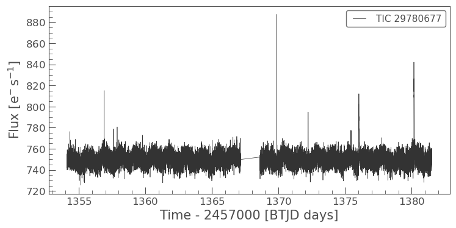
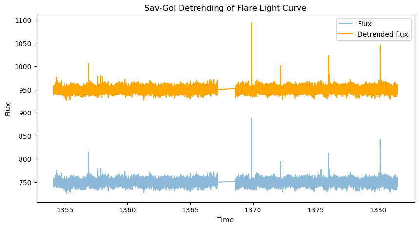
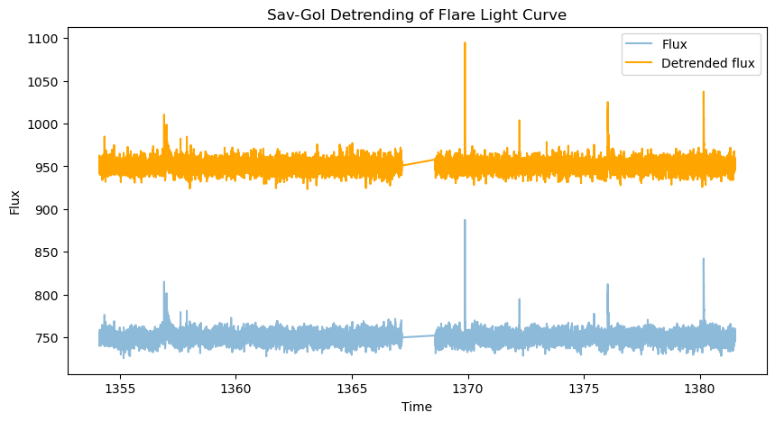
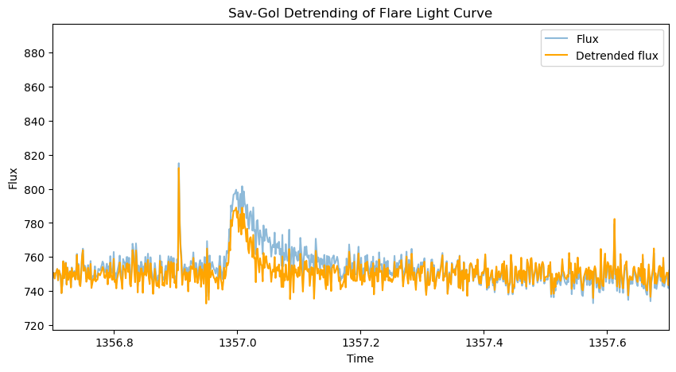
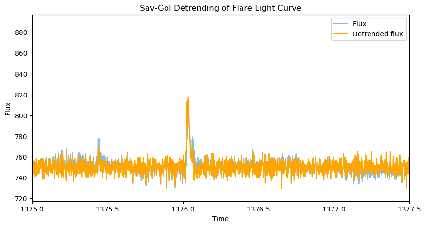
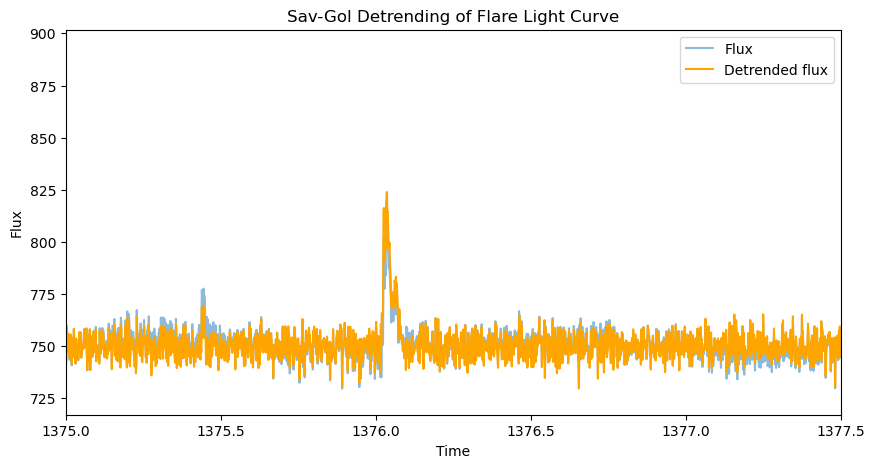
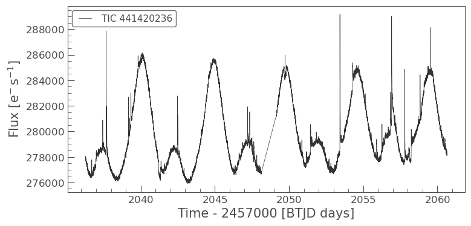
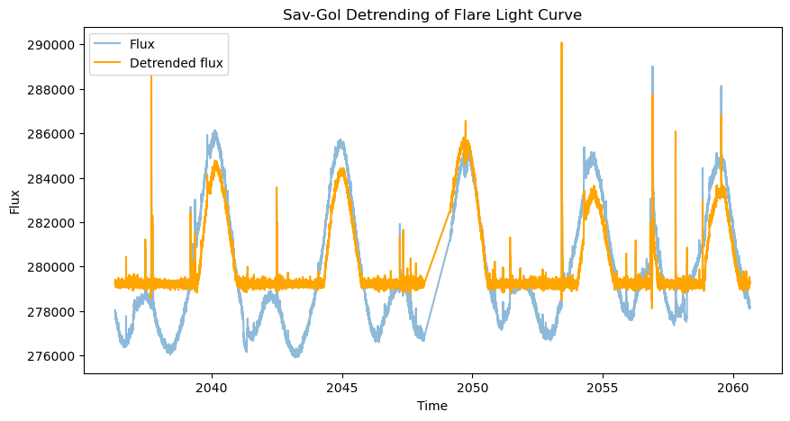
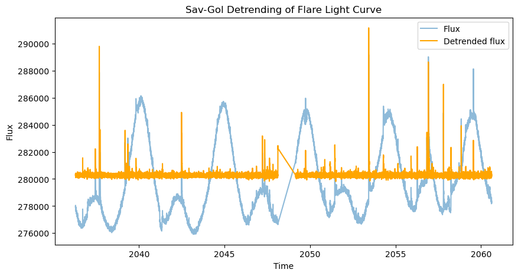

Detrending light curves with AltaiPony
======================================

De-trending [dɪ.tɹˈɛndɪŋ] of lightcurves denotes the removal of
instrumental or some physical trends in order to improve the analysis of
other physical trends, in our case, flares. Flaring stars show
variability on different timescales, with flares typically being a very
fast variation. That allows us to separate it from the *usually* slower
star-spot induced variability, even if the latter has a higher
amplitude.

In this tutorial, we will go through the de-trending pipeline in
AltaiPony, including a Savitzky-Golay filter-based de-trending and a
more involved custom detrening method tailored toward removing heavy
spot variability from very active stars while preserving the flare
signal. In the end, you will also learn how to use your own detrending
function within AltaiPony.

.. code:: ipython3

    import lightkurve as lk
    
    from altaipony.customdetrend import custom_detrending
    from altaipony.lcio import to_flare_lightcurve
    
    import matplotlib.pyplot as plt

Let’s start grabbing a TESS light curve of TIC 29780677, a young, active
star, observed with TESS with ``search_lightkurve``:

.. code:: ipython3

    # get a table of light curves from MAST
    lc_table = lk.search_lightcurve("TIC 29780677", sector=2, exptime=120, mission="TESS", author="SPOC")
    
    lc_table

.. csv-table:: TESS Observations
   :header: "#", "Mission", "Year", "Author", "Exptime (s)", "Target Name", "Distance (arcsec)"
   :widths: 5, 15, 8, 10, 12, 15, 15
   :class: small-table
   
   0, TESS Sector 02, 2018, SPOC, 120, 29780677, 0.0

Let download the lightcurve:

.. code:: ipython3

    %matplotlib inline
    lc = lc_table[0].download()
    lc.plot();

.. parsed-literal::

    2% (399/18699) of the cadences will be ignored due to the quality mask (quality_bitmask=175).
    2% (399/18699) of the cadences will be ignored due to the quality mask (quality_bitmask=175).

Just like in the Quickstart tutorial, this light curve also shows
flares. Now let’s make ``lc`` a FlareLightCurve object, and apply
detrending:

.. code:: ipython3

    def plot_detrending(flcd_savgol, offset=200):
        plt.figure(figsize=(10, 5))
        plt.plot(flcd_savgol.time.value, flcd_savgol.flux, label='Flux', alpha=0.5)
        plt.plot(flcd_savgol.time.value, flcd_savgol.detrended_flux+offset, label='Detrended flux', color='orange')
        plt.xlabel('Time')
        plt.ylabel('Flux')
        plt.title('Sav-Gol Detrending of Flare Light Curve')
        plt.legend()
        
    flc = to_flare_lightcurve(lc)
    flcd_savgol = flc.detrend("savgol")
    

.. code:: ipython3

    savgol_flares = flcd_savgol.find_flares().flares

.. parsed-literal::

    Found 0 candidate(s) in the (0,9226) gap.
    Found 4 candidate(s) in the (9226,18300) gap.

There are three main parameters to play with: ``w`` (default=121),
``max_sigma``\ (defaul=2.5), and ``longdecay``\ (default=6).

``w`` is the length of the Sav-Gol filter. Larger window means lower
frequency pass, filtering out modulation on lower timescales.

.. code:: ipython3

    flcd_savgol2 = flc.detrend("savgol", w=10001)
    plot_detrending(flcd_savgol2)

Too small ``w`` can approach the timescales of the flares themselves,
distorting them, especially if the flare is not fully masked, which can
happen if ``max_sigma`` is set too high:

Larger ``max_sigma`` filters out fewer flare points before applying the
filter, leading to a worse detrending around long-duration flares. On
the other hand, too low ``max_sigma`` preserved more noise in the
detrended data:

.. code:: ipython3

    from altaipony.fakeflares import flare_model_mendoza2022
    import astropy.units as u
    flcl = flc.copy()
    t = flcl.time.value
    long_duration_flare = flare_model_mendoza2022(t, tpeak=1357.0, ampl=50, fwhm=.04)
    flcl.flux += long_duration_flare * u.electron / u.second
    
    
    # too low max_sigma preserves noise
    flcd_savgol3 = flcl.detrend("savgol", max_sigma=1.5)
    plot_detrending(flcd_savgol3, offset=200)
    
    # too high max_sigma exposes long-duration flares to filtering
    flcd_savgol4 = flcl.detrend("savgol", max_sigma=30)
    plot_detrending(flcd_savgol4, offset=0)
    plt.xlim(1356.7, 1357.7);

Finally, the ``longdecay`` parameter. The sigma-clipping pipeline
running under the hood of the Sav-Gol de-trender will expand the
filtering mask around the outliers by
:math:`\sqrt{\text{length of the outliers series}}`. If longdecay=1,
this completes the mask expansion. If longdecay=2, the tail of the
series of outliers is expanded twice, thrice for longdecay=3, and so on.

Below, we can see how keeping the longdecay parameter too short exposes
the flare tail to the Sav-Gol filter. Making it too long on the other
hand, prevents the filter from de-trending accurately in the area (not
shown).

.. code:: ipython3

    flcd_savgol5 = flcl.detrend("savgol", longdecay=1)
    plot_detrending(flcd_savgol5, offset=0)
    plt.xlim(1375, 1377.5)
    
    flcd_savgol6 = flcl.detrend("savgol", longdecay=6)
    plot_detrending(flcd_savgol6, offset=0)
    plt.xlim(1375, 1377.5);

The Savitzky-Golay filter works well on light curves like the one above,
where there is low-amplitude variability on a time scale much shorter
than the light curve, but longer than the flare. However, oftentimes
spot variability occurs on timescale close to the light curve length
(especially for the shorter TESS light curves). For this, the ``custom``
detrending add a spline fit with an variable time step between 5h and
15h, as a first step in the analysis, and follows it up by two Sav-Gol
detrending iterations to remove variability on 6h and 3h timescales.

To see what that means, let’s try a different light curve:

.. code:: ipython3

    # get a table of light curves from MAST
    lc = lk.search_lightcurve('AU Mic', mission='TESS', author='SPOC', exptime=120, sector=27)[0].download()
    
    lc.plot();

.. parsed-literal::

    0% (31/16812) of the cadences will be ignored due to the quality mask (quality_bitmask=175).
    0% (31/16812) of the cadences will be ignored due to the quality mask (quality_bitmask=175).

.. code:: ipython3

    flc = to_flare_lightcurve(lc)
    flcd_savgol_aumic = flc.detrend("savgol")
    plot_detrending(flcd_savgol_aumic)

The filter clearly missed the longer-duration arc of the spot
modulation. This calls for an additional step to remove the
large-amplitude variability, cue the custom detrending method:

Custom De-trending with AltaiPony
---------------------------------

The custom de-trending method implemented in AltaiPony combines a
flexible spline fit with two Savitzky-Golay iterations, which
successively separate fast flare signal from slow(er) rotational
modulation. The parameters from the Savitzky-Golay detrender can be
passed to those two iterations. The spline fit iterates over different
coarseness parameters, and spline orders, and penalizes the lack of
positive outliers to avoid splining away flares by accident:

.. code:: ipython3

    flcd_custom_aumic = flc.detrend("custom", func=custom_detrending)
    plot_detrending(flcd_custom_aumic)

Much better than just Sav-Gol!

Note how the de-trending can still distort large or long-duration flares
(e.g., around t=2053.5d). This does not prevent them from being
detected, but the flare energy estimated will be biased as a result and
smaller flares in their vicinity might be missed. Therefore,
``fit_flares()`` fits a flare around the event’s region, which both
catches additional smaller flares by fitting several flare templates and
finding the best-fit result, and calculates a polynomial baseline around
the already detected event (see Getting Started tutorial).

You own de-trending function
~~~~~~~~~~~~~~~~~~~~~~~~~~~~

Note also the syntax of the de-trending call above. You can pass *any*
detrending function if you use the keyword “custom”. Make sure that the
function returns a ``FlareLightCurve`` object, and that the output is
stored as ``detrended_flux``, ``detrended_flux_err`` keywords to pass
the result to the flare finder.

