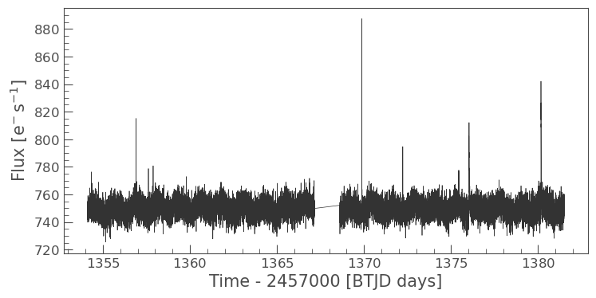
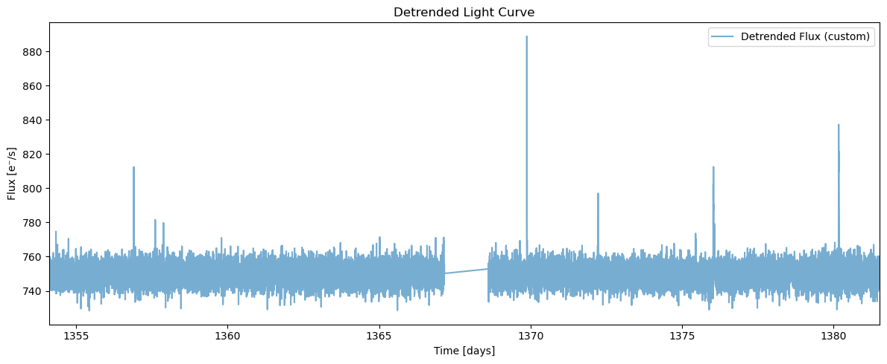
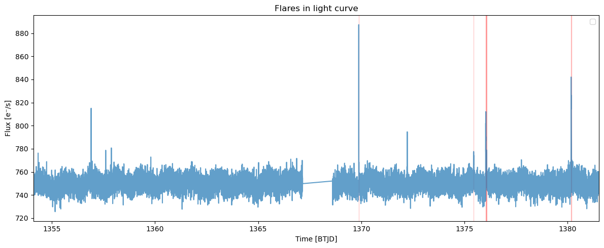
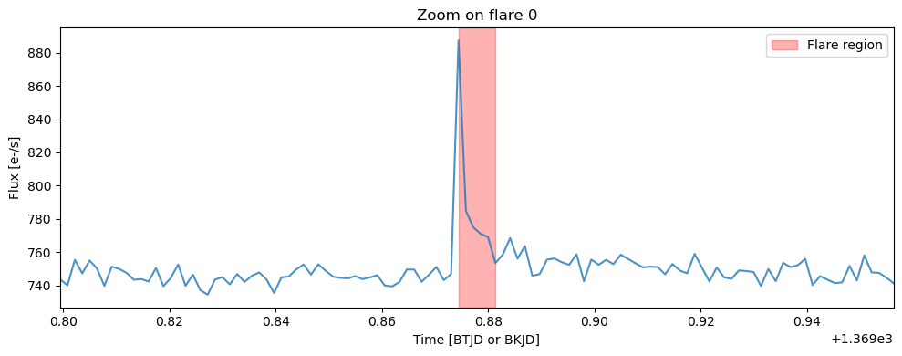
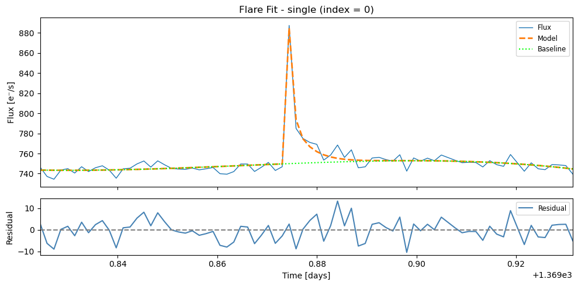
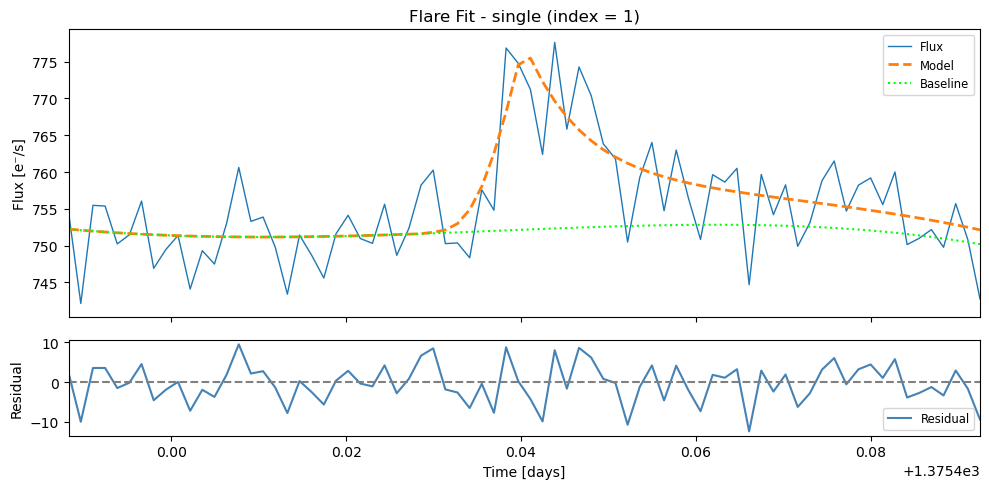
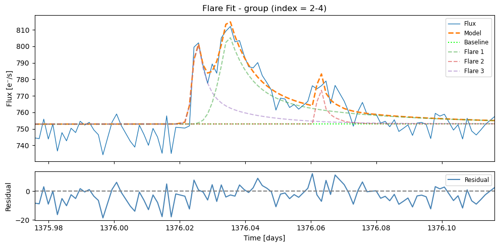
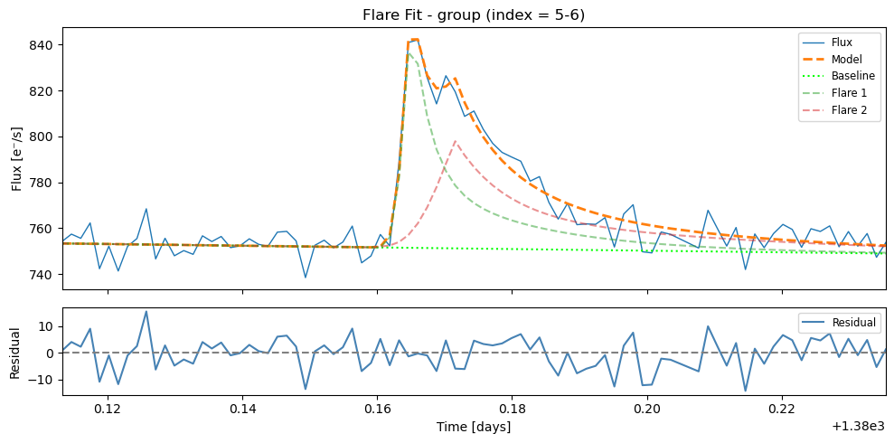
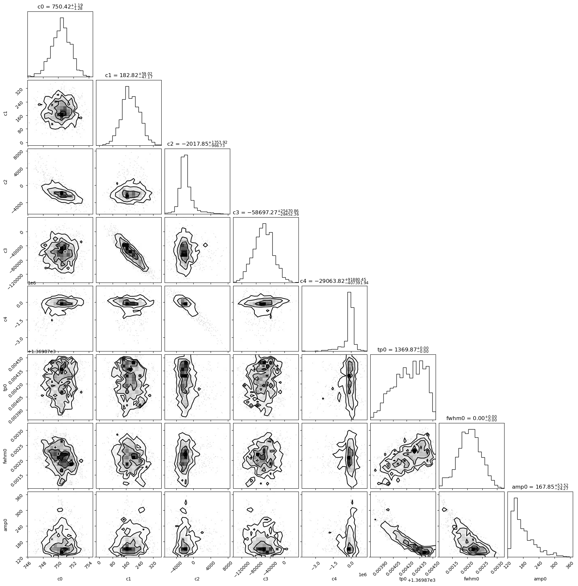

Flare Fitting with Bayesian model comparison
============================================

This tutorial introduces the flare fitting module for AltaiPony. It
models stellar flares using analytic flare shapes from Davenport et
al. (2014), combined with a polynomial baseline. The ``find_flares()``
detection results (``tstart``, ``tstop``) are used to define the fitting
regions, which are automatically expanded by a small time buffer to
ensure full flare coverage. Each region may contain one or more
overlapping flares. For each region, the model is optimized for
different numbers of flares (1 to ``max_flares``) using ``emcee``.

**1. Load and Detrend the Light Curve**

- Load a light curve from TESS or Kepler using
  ``lightkurve.search_lightcurve()``
- Convert to ``FlareLightCurve`` with ``to_flare_lightcurve``
- Detrend with ``FlareLightCurve.detrend()``

**2. Detect Candidate Flares**

- Detect flares using ``find_flares()``
- This generates an initial table of flare candidates with approximate
  parameters:

  - ``tstart``, ``tstop``: start and stop times of each candidate
  - ``ampl_rec``, ``ed_rec``: estimates of flare amplitude and
    equivalent duration

- These parameters are refined using model fitting
- It is advised to visually inspect whether the flare windows fully
  capture each event and exclude unrelated variability.

**3. Fit Flares**

- Fit flare shapes with a composite model (polynomial baseline +
  analytic flares)
- Evaluate model quality using BIC
- Extract posterior uncertainties

**4. Build Summary Table**

- Use ``flare_table()`` to construct the final flare parameter table
  from the best-fit models
- This updates the preliminary ``find_flares()`` estimates with
  model-derived values and posterior errors

**5. Inspect Posterior Distributions**

- Use ``corner(index)`` to plot the posterior distributions for a
  specific row in the flare table
- ``index`` corresponds to the row number (e.g. ``0`` for the first row)
- Automatically redirects to the group-level posterior if the row is a
  ``group_member``

.. code:: ipython3

    import matplotlib.pyplot as plt
    from altaipony.lcio import to_flare_lightcurve
    from altaipony.customdetrend import custom_detrending
    import lightkurve as lk

1. Load and detrend the light curve
-----------------------------------

.. code:: ipython3

    %matplotlib inline
    lcs = lk.search_lightcurve("TIC 29780677", sector=2, exptime=120, mission="TESS", author="SPOC")
    lc = lcs[0].download()
    flc = to_flare_lightcurve(lc)
    
    flc.plot()
    
    
    flcd = flc.detrend("custom", func=custom_detrending)
    
    plt.figure(figsize=(12, 5))
    
    plt.plot(flcd.time.value, flcd.detrended_flux, label='Detrended Flux (custom)', alpha=0.6)
    plt.xlim(flcd.time.value.min(), flcd.time.value.max())
    plt.xlabel("Time [days]")
    plt.ylabel("Flux [e⁻/s]")
    plt.title("Detrended Light Curve")
    plt.legend()
    plt.tight_layout()
    plt.show() 

.. parsed-literal::

    2% (399/18699) of the cadences will be ignored due to the quality mask (quality_bitmask=175).
    2% (399/18699) of the cadences will be ignored due to the quality mask (quality_bitmask=175).
    /home/ilin/anaconda3/envs/altaidev/lib/python3.12/site-packages/altaipony/flarelc.py:465: UserWarning: Lightkurve doesn't allow columns or meta values to be created via a new attribute name.A new attribute is created. It will not be carried over when the object is copied. - see https://docs.lightkurve.org/reference/api/lightkurve.LightCurve.html
      lc.gaps = split_gaps(gaps, splits)

2. Detect candidate flares
--------------------------

We use the built-in flare detection method via the ``find_flares()``.

.. code:: ipython3

    flcd = flcd.find_flares()
    flcd.flares.sort_values(by="tstart", ascending=True)

.. parsed-literal::

    Found 0 candidate(s) in the (0,9226) gap.
    Found 5 candidate(s) in the (9226,18300) gap.
    /home/ilin/anaconda3/envs/altaidev/lib/python3.12/site-packages/altaipony/altai.py:210: FutureWarning: The behavior of DataFrame concatenation with empty or all-NA entries is deprecated. In a future version, this will no longer exclude empty or all-NA columns when determining the result dtypes. To retain the old behavior, exclude the relevant entries before the concat operation.
      lc.flares = pd.concat([lc.flares, new], ignore_index=True)

.. csv-table:: Detected flare candidates
   :header: "Index", "istart", "istop", "cstart", "cstop", "tstart", "tstop", "ed_rec", "ed_rec_err", "ampl_rec", "dur", "n_valid"
   :widths: 5, 7, 7, 7, 7, 10, 10, 10, 10, 10, 8, 7
   :class: small-table
   
   0, 10142, 10147, 102541, 102546, 1369.874, 1369.881, 39.64, 1.551, 0.18601, 0.007, 18300
   1, 14075, 14078, 106547, 106550, 1375.438, 1375.442, 10.00, 1.582, 0.03119, 0.004, 18300
   2, 14483, 14501, 106969, 106987, 1376.024, 1376.049, 125.42, 3.796, 0.08412, 0.025, 18300
   3, 14507, 14512, 106994, 106999, 1376.059, 1376.066, 20.21, 2.028, 0.03975, 0.007, 18300
   4, 17372, 17388, 109949, 109965, 1380.163, 1380.185, 135.29, 3.725, 0.11716, 0.022, 18300

We now have:

1. A **detrended light curve** with reduced stellar variability, which
   improves flare detection.
2. A set of **flare candidates** identified using ``find_flares()``.
3. A **preliminary table of flare properties**, including approximate
   times (``tstart``, ``tstop``), amplitudes (``ampl_rec``), and
   equivalent durations (``ed_rec``, ``ed_rec_err``).

These initial estimates will be refined through model fitting in the
next step.

3. Visualize detected flares
----------------------------

After detecting flares with ``find_flares()``, it is useful to visually
inspect whether the detected regions (``tstart``, ``tstop``) correctly
enclose the flare events and do not include unrelated variability.

We plot the original and detrended light curves, with the flare regions
highlighted using red spans. This helps verify that: - The flare windows
fully capture the flare peaks - No flares were missed due to overly
strict thresholds - The detrending preserved flare morphology

We can also zoom in on an individual flare regions for detailed
inspection.

.. code:: ipython3

    
    # Show all detected flares in the light curve
    flcd.highlight_all_flares_in_lightcurve()
    
    # Plot zoomed-in views of each detected flare
    flcd.zoom_in_on_flare(0)

4. Fit flares
-------------

We now apply the flare fitting module to the flare regions detected by
``find_flares()``. Each region is defined by a ``tstart``-``tstop``
pair, and is automatically expanded by a small time buffer cover the
full flare and some quiescent flux. Regions that overlap or occur close
together are grouped and fitted simultaneously.

The flare fitting function: The ``fit_flares()`` function accepts
several user-configurable arguments:

- | ``buffer``:
  | The time (in days) added before and after each flare detection
    window. This ensures the flare is not clipped at the edges and
    allows for a more stable baseline fit. A typical value is ``0.05``
    (i.e., 72 minutes).

- | ``max_flares``:
  | The maximum number of flare components to attempt fitting in each
    region. The function will try all models from ``n = 1`` up to
    ``n = max_flares`` and select the best one based on BIC.

- | ``delta_bic``:
  | Minimum BIC improvement required to accept a more complex model.
  | This helps avoid overfitting by rejecting additional flares that do
    not significantly improve the fit.
  | **Example:** ``delta_bic=2`` means a model must improve BIC by at
    least 2 points to be accepted.

- | ``plot``:
  | If ``True``, plots will be generated during fitting to show the best
    model per region.
  | **Recommended:** Turn it off when processing large numbers of
    flares.

- | ``debug_plot``:
  | If ``True``, additional plots are shown for *all attempted models*
    in each region (e.g., for ``n = 1``, ``n = 2``, ``n = 3``).
  | This is useful for understanding how BIC selects the optimal flare
    count, and for spotting overfitting or poor fits.
  | **Set to ``False``** for normal use or large datasets, as this can
    produce a large number of plots.

**Note: Detrending vs Fitting Input**

While the ``find_flares()`` function **requires** a detrended light
curve to reliably detect flux enhancements due to flares, the flare
fitting module (``fit_flares()``) is best applied to the **original,
non-detrended** flux.

This is because detrending methods (e.g., Savitzky-Golay filters) can
distort flare shapes by artificially modifying the baseline near flare
events.

.. code:: ipython3

    fit = flcd.fit_flares(
        buffer=0.05,          # Add ±0.05 buffer before/after each flare region for safe margin
        max_flares=3,         # Test models with 1–3 flares per region
        delta_bic=2.0,        # Only accept a more complex model if BIC improves by at least 2 points
        plot=True,            # Plot only the best fit for each region
        debug_plot=False,      # Suppress intermediate trial fits (e.g. for n = 1, 2, 3)
        n_steps = 1000,       # Number of MCMC steps per walker
        nwalkers = 30        # Number of MCMC walkers
    )

.. parsed-literal::

    
     Fitting region from 1369.82443 to 1369.93137; Region [0](max. number of flares in group = 3 x 1)

.. parsed-literal::

    100%|██████████| 1000/1000 [00:06<00:00, 144.25it/s]
    100%|██████████| 1000/1000 [00:06<00:00, 153.01it/s]
    100%|██████████| 1000/1000 [00:06<00:00, 146.41it/s]

.. parsed-literal::

    
     Fitting region from 1375.38828 to 1375.49245; Region [1](max. number of flares in group = 3 x 1)

.. parsed-literal::

    100%|██████████| 1000/1000 [00:06<00:00, 145.45it/s]
    100%|██████████| 1000/1000 [00:06<00:00, 164.94it/s]
    100%|██████████| 1000/1000 [00:05<00:00, 169.62it/s]

.. parsed-literal::

    
     Fitting region from 1375.97439 to 1376.11606; Region [2](max. number of flares in group = 3 x 2)

.. parsed-literal::

    100%|██████████| 1000/1000 [00:07<00:00, 131.54it/s]
    100%|██████████| 1000/1000 [00:07<00:00, 131.88it/s]
    100%|██████████| 1000/1000 [00:09<00:00, 108.89it/s]
    100%|██████████| 1000/1000 [00:10<00:00, 95.60it/s]
    100%|██████████| 1000/1000 [00:12<00:00, 81.23it/s]
    100%|██████████| 1000/1000 [00:14<00:00, 67.31it/s]

.. parsed-literal::

    
     Fitting region from 1380.11325 to 1380.23547; Region [3](max. number of flares in group = 3 x 1)

.. parsed-literal::

    100%|██████████| 1000/1000 [00:08<00:00, 124.62it/s]
    100%|██████████| 1000/1000 [00:08<00:00, 113.44it/s]
    100%|██████████| 1000/1000 [00:08<00:00, 111.12it/s]

We compile all results into a summary table that lists the properties of
each detected and fitted flare. This is done using ``flare_table()``,
which extracts key parameters from the results list.

.. code:: ipython3

    results = flcd.flare_table(fit)
    display(results)

.. csv-table:: Fitted flare parameters
   :header: "Index", "t_peak", "t_peak_err", "fwhm", "fwhm_err", "amplitude", "amplitude_err", "ed_rec", "fit_type", "group_index"
   :widths: 5, 11, 10, 8, 8, 11, 11, 8, 10, 8
   :class: small-table
   
   0, 1369.874236, 0.000176, 0.002145, 0.000397, 169.17, 35.15, 41.77, single, --
   1, 1375.440132, 0.001119, 0.020102, 0.014584, 26.13, 5.76, 47.37, single, --
   2, 1376.035175, 0.000484, 0.032623, 0.007751, 62.85, 6.42, 184.81, group_member, 1
   3, 1376.062745, 0.001452, 0.016152, 0.014561, 24.69, 16.76, 38.33, group_member, 1
   4, 1376.024842, 0.000182, 0.005499, 0.002428, 67.59, 15.91, 38.99, group_member, 1
   5, 1380.165041, 0.000168, 0.008708, 0.001504, 98.95, 10.17, 90.64, group_member, 2
   6, 1380.171784, 0.000851, 0.028435, 0.007585, 51.80, 7.74, 129.64, group_member, 2

**Notes**

- ``ed_rec``: The equivalent duration values in the table are derived
  from the best-fit analytic flare model, rather than by directly
  summing the observed flux within the ``tstart``-``tstop`` detection
  window. This model-based approach provides more estimates that are
  less sensitive to noise, outliers, or the exact placement of the
  detection window. However, it also means that the ED values are
  **dependent on the shape defined by the flare model.**

- ``fit_type`` indicates the context of the fit:

  - ``"single"``: the flare was fit individually (no nearby overlapping
    events)
  - ``"group"``: the combined fit of a group of overlapping flares
  - ``"group_member"``: a single flare extracted from a group fit

- ``group_index`` gives the ID of each flare group (1, 2, 3, …). All
  flares sharing the same group index were modeled together. The group
  row (if present) summarizes the overall multi-flare fit, while the
  ``group_member`` rows list the individual flares. You can get the
  group-wise solution by adding the keyword argument
  ``include_group_rows=True`` in ``flare_table()``.

5. Inspect posterior distributions
----------------------------------

The ``corner()`` function displays the posterior distributions of the
flare model parameters for a selected row in the flare table. This helps
assess the uncertainty and correlation structure of the fitted values.

To use it, pass the index of the row you want to inspect:

.. code:: ipython3

    flcd.corner(0)

This shows a corner plot for the flare fit in row 0 of the table. If the
selected row corresponds to a ``group_member``, the method automatically
loads the full posterior from the associated group fit.

The plot includes:

- ``c0–c4``: coefficients of the 4th-order baseline polynomial

- ``tp{i}``: peak times of each fitted flare

- ``fwhm{i}``: flare widths

- ``amp{i}``: flare amplitudes

This can be used to verify that parameters are well-constrained and to
explore any potential degeneracies between model components.
