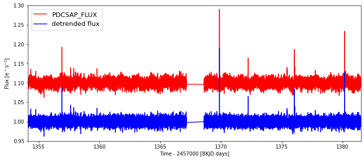
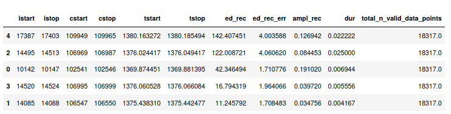

Finding Flares
=====

First you'll need a de-trended light curve (more details on de-trending here_.). Let's pick a TESS light curve:

::
   
     rawflc = from_mast("TIC 29780677", mode="LC", c=2, mission="TESS")

If you have a raw ``FlareLightCurve`` we can call ``rawflc``, for Kepler and TESS light curves use:

::

    flc = rawflc.detrend("savgol")

The following snippet shows the difference: The raw flux is still stored in ``flc.flux``, the de-trended flux is in ``flc.detrended_flux``

::
   
     import matplotlib.pyplot as plt
    plt.figure(figsize=(12,5))
    plt.plot(flc.time, flc.flux / np.nanmedian(flc.flux)+0.1, c="r", label="PDCSAP_FLUX")
    plt.plot(flc.time, flc.detrended_flux / np.nanmedian(flc.detrended_flux), "b", label="detrended flux")
    plt.xlabel("Time - 2457000 [BKJD days]")
    plt.ylabel(r"Flux [e$^-$s$^{-1}$]")
    plt.xlim(flc.time[0], flc.time[-1])
    plt.ylim(.95,1.30)
    plt.legend(loc=2,fontsize=13);

**Note:** K2 is more difficult, and computationally intense, but doable with:

::
    
    flc = rawflc.detrend("k2sc")

Now you have a de-trended light curve ``flc``, and you can search it for flares:

::
    
    flc = flc.find_flares()

This will return the initial light curve with a new attribute - ``flares``, which is a DataFrame_ with the following columns:

* ``ampl_rec`` - recovered amplitude measured relative to the quiescent stellar flux
* ``ed_rec`` - recovered equivalent duration of the flare, that is, the are under the light curve with quiescent flux subtracted.
* ``ed_rec_err`` - the minimum uncertainty on equivalent duration derived from the uncertainty on the flare flux values (see `Davenport (2016)`_ for details, Eq. (2)).
* ``cstart, cstop, istart, istop, tstart, tstop`` - start and end of flare candidates in units of cadence, array index and actual time in days.
* ``dur`` - which is ``tstop-tstart``
* ``total_n_valid_data_points`` -  number of data points search for flare epochs in the de-trended light curve.

In our case, it should look like this:

Defining flare candidates
^^^^^^^^^^^^^^^^^^^^^^^^^

In ``FlareLightCurve.find_flares()``, the flare candidate definition follows the criteria in `Chang et al. (2015)`_ Eqn. (3) a-d. 

* Flare candidate data points must be positive excursions from the median quiescent flux value.
* The positive offset must be at least :math:`N_1` :math:`\sigma` above the local scatter of the light curve. If the local scatter is not given explicitly by the ``sigma`` keyword, ``FlareLightCurve.detrended_flux_err`` will be used instead, which is equal to PDCSAP_FLUX_ERR in Kepler and TESS light curves.
* The positive offset + ``FlareLightCurve.detrended_flux_err`` must be at least :math:`N_2` :math:`\sigma` above the local scatter.
* The number of consecutive data points fulfilling the above criteria must be at least :math:`N_3`.

You can pass :math:`N_{1,2,3}` and ``sigma`` explicitly like 

::

    FlareLightCurve.find_flares(N1=3, N2=2, N3=3, sigma=<local_scatter_array>)

The default settings are: ``N1=3``, ``N2=2``, ``N3=3``. ``sigma`` defaults to ``FlareLightCurve.detrended_flux_err``.  So, if you do not want to pass an array of local scatter values with the keyword argument ``sigma`` to ``find_flares()``, the :math:`N_2` specification  automatically becomes the more restrictive criterion. In this scenario, choosing ``N1=3`` and ``N2=2`` check for the same criterion.

**Note 1:** You can only apply the ``find_flares()`` method once to each de-trended light curve to avoid accidently listing flare candidates obtained with diffent sets of criteria in a single table. If you want to try different sets you have to create a copy of your ``FlareLightCurve`` for each set.

**Note 2:** Another argument to tinker with is the ``minsep`` keyword. The default is ``minsep=3``, meaning that candidate flare events within 3 data points of each other are combined into one.

.. _here: https://altaipony.readthedocs.io/en/latest/api/lcio.html
.. _DataFrame: https://pandas.pydata.org/pandas-docs/stable/reference/api/pandas.DataFrame.html
.. _Davenport (2016): https://iopscience.iop.org/article/10.3847/0004-637X/829/1/23
.. _Chang et al. (2015): https://ui.adsabs.harvard.edu/abs/2015ApJ...814...35C/abstract
