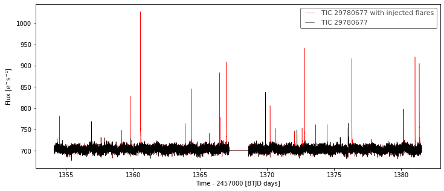
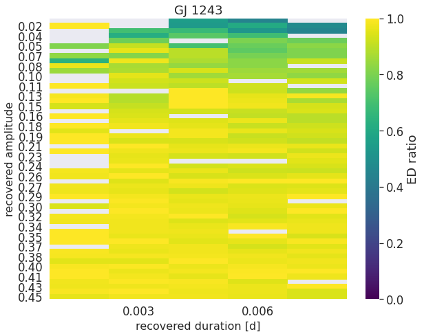
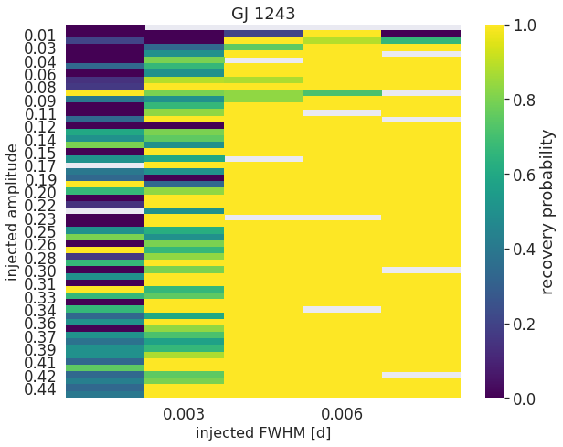
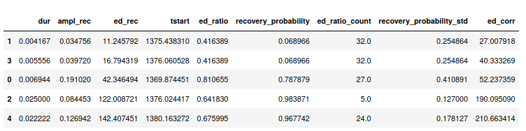

Synthetic Flare Injection and Recovery
=====

To characterize how well the de-trending and flare finding procedures actually find and characterized flares in a light curve you can inject synthetic flares into it and run the procedures to compare the recovered events to the injected ones. In **AltaiPony**, the shapes of the flares are generated using the emprical flare model from `Davenport et al. (2014)`_.

To run a series of injections, call the ``sample_flare_recovery()`` method on a ``FlareLightCurve``.

::

    from altaipony.lcio import from_mast
    flc = from_mast("TIC 29780677", mode="LC", c=2, mission="TESS")
    flc = flc.detrend("savgol")
    flc, fake_flc = flc.sample_flare_recovery(inject_before_detrending=True, mode="savgol", 
                                              iterations=50, fakefreq=1, ampl=[1e-4, 0.5], 
                                              dur=[.001/6., 0.1/6.])

``flc`` is the original light curve with a new attribute ``fake_flares``, which is a DataFrame_ that includes the following columns:

* ``amplitude``: the synthetic flare's relative amplitude
* ``duration_d`` : the synthetic flare's duration in days [1]_
* ``ed_inj``: injected equivalent duration in seconds
* ``peak_time``: time at which the synthetic flare flux peaks 	
* all columns that appear in the `flares` attribute of `FlareLightCurve`, see here_. If the respective row has a value, the synthetic flare was recovered with some results, otherwise **AltaiPony** could not re-discover this flare at all.

``fake_flc`` is just like the original one, but without the ``fake_flares`` attribute. Instead, its flux contains synthetic flares from the last iteration run by ``sample_flare_recovery``. We return it because it is often useful to see what one actually injects:

::  

    import matplotlib.pyplot as plt
    fig, ax = plt.subplots(figsize=(12,5))
    fakeflc.plot(ax=ax, c="r", label="TIC 29780677 with injected flares")
    flc.plot(ax=ax, c="k")

Visualizing results
--------------------

Let's pick GJ 1243, a famous flare star, inject and recover some flares and look at the results. We follow the same step as before, but inject about 1000 synthetic flares. The setup below produces the minimum number of 1 flare per light curve chunk per iteration, and the TESS light curve of GJ 1243 is split into two uniterrupted segments, therefore, we run 500 iterations. You can get faster results by increasing ``fakefreq``. 

::

    from altaipony.lcio import from_mast
    flc = from_mast("GJ 1243", mode="LC", c=15, mission="TESS")
    flc = flc.detrend("savgol")
    flc, fake_flc = flc.sample_flare_recovery(inject_before_detrending=True, mode="savgol", 
                                              iterations=500, fakefreq=.01, ampl=[1e-4, 0.5], 
                                              dur=[.001/6., 0.1/6.])

We can now look at what fraction of the injected equivalent duration of flares with different recovered amplitudes and durations is recovered:

::

    fig = flc.plot_ed_ratio_heatmap(flares_per_bin=.3)
    plt.title("GJ 1243")

Similarly, we can illustrate what fraction of flares with different injected amplitudes and full-width-at-half-maximum values (:math:`t_{1/2}` in `Davenport et al. (2014)`_) is recovered:

::

    fig = flc.plot_recovery_probability_heatmap(flares_per_bin=.3)
    plt.title("GJ 1243");

Flare characterization
-----------------------

What can we do with all these synthetic flares? We can use them to characterize the flare candidates in the original light curve. To do this, call the ``characterize_flares`` method on your ``FlareLightCurve``:

::
  
   flc = flc.characterize_flares(ampl_bins=10, dur_bins=10)

This method will tile up your sample of fake flares into amplitude and duration bins twice. First, it will tile up the sample into a matrix based on the *recovered* amplitude and durations. Second, it will do the same with the *injected* properties, and so include also those injected flares that were not recovered. 

The first matrix can be used to map each flare candidate's recovered equivalent duration to a value that accounts for losses dealt to the ED by photometric noise, and introduced by the de-trending procedure (if you chose ``inject_before_detrending=True`` above). The typical injected amplitude and duration of flares in that tile of the matrix can then be used by the second matrix to derive the candidate's recovery probability from the ratio of lost to recovered injected flares.

The results from this mapping are stored in the ``flares`` attribute, which now contains the following additional columns in the table:

* ``dur``: ``= tstop - tstart``

* ``ed_ratio``: ratio of recovered ED to injected ED in the synthetic flares in the matrix tile that contains flares with measured properties that are most similar to the candidate flare.
* ``ed_ratio_count``: number of synthetic flares in the tile
* ``ed_ratio_std``: standard deviation of ED ratios in the tile
* ``ed_corr``: ``= rec_err / ed_ratio``
* ``ed_corr_err``: quadratically propagated uncertainties, including ``ed_rec_err`` and ``ed_ratio_std``

As in ``ed_ratio`` but with amplitude:

* ``amplitude_ratio``
* ``amplitude_ratio_count``
* ``amplitude_ratio_std``
* ``amplitude_corr``
* ``amplitude_corr_err`` : uncertainty propagated from ``amplitude_ratio_std``

As in ``amplitude_ratio`` but with duration in days:

* ``duration_ratio``
* ``duration_ratio_count``
* ``duration_ratio_std``
* ``duration_corr``
* ``duration_corr_err``

As in the columns but now for recovery probability:

* ``recovery_probability``: float between 0 and 1
* ``recovery_probability_count``
* ``recovery_probability_std``

"Properties" always refers to amplitude and duration or FWHM.

For a subset of these parameters, ``flc.flares`` could look like this:

.. rubric:: Footnotes

.. [1] At the moment this is not a very meaningful quantity because the decay of the flare goes on to infitiny! We may define full width at 1% of the fluxe or something as an approximation but that is for later and I am getting distracted. But we need it to map between injected and recovered flares, that is why it's hanging around in that table.

.. _DataFrame: https://pandas.pydata.org/pandas-docs/stable/reference/api/pandas.DataFrame.html
.. _here: https://altaipony.readthedocs.io/en/latest/api/altai.html
.. _Davenport et al. (2014): https://ui.adsabs.harvard.edu/abs/2014ApJ...797..122D/abstract
