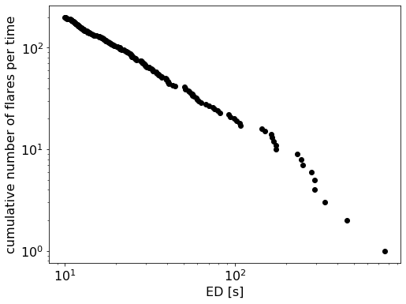
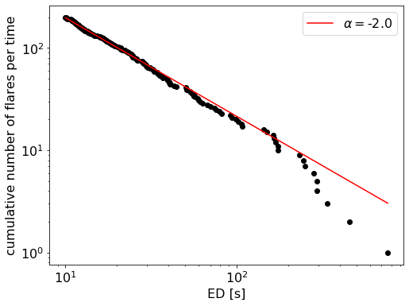

Flare Frequency Distributions and Power Laws
==============================================

Once you have found all the flares, you can compute statistical measures using your flare table. 

The `FFD` module allows you to compute Flare Frequency Distributions. You can use it to

- convert the flare table into a cumulative flare frequency distribution
- fit the power law exponent :math:`\alpha` and intercept :math:`\beta`, 
- plot the resulting function in the cumulative form,
- test if the power law assumption must be rejected, 
- test if the distribution is truncated at the high energy end,
- apply statistical corrections to the flare properties using the ``ed_corr``, ``recovery_probability`` attributes of the flares in the flare table that you may obtain from performing *injection and recovery of synthetic flares* with ``FlareLightCurve.characterize_flares()``.

Finally, if your flare table contains contributions from multiple stars that you think generate flares that can be described by the same power law but with different detection thresholds, you can use the `multiple_stars` keyword to account for this to a first order approximation. 

*Note that results from samples with less than 100-200 flares should be interpreted with caution.*

A simple flare sample
-----------------------------

In the simplest of all cases, there is one star that was observed for a certain time with high cadence and very low noise. For the resulting light curve we obtained a table of flare candidates, for instance, using ``FlareLightCurve.find_flares()``.

Now, you can directly use the ``FlareLightCurve.flares`` table, or any ``pandas.DataFrame`` where the recovered flare energies column is named ``ed_rec``.

Assume we have such a ``FlareLightCurve`` called ``flc`` with the required attribute ``flc.flares``, we can create a ``FFD`` object 

::

    from altaipony.ffd import FFD
    simple_ffd = FFD(f=flc.flares)

``simple_ffd.f`` contains the table with the energies of the flares. We can also specify the observing time it took to detect the event listed in the table:

::

    simple_ffd.tot_obs_time = 20.
    
The unit is up to you, and you should know which one you are using. If you do not specify ``tot_obs_time``, the FFD frequencies will instead be the number counts, i.e. ``simple_ffd.tot_obs_time=1.``.

Convert the flare table into a cumulative flare frequency distribution
^^^^^^^^^^^^^^^^^^^^^^^^^^^^^^^^^^^^^^^^^^^^^^^^^^^^

The first method you apply before doing anything else is ``FFD.ed_and_freq()``. It gives you the sorted array of energies, their corresponding frequencies, and number counts for each event with a certain energy, that is the cumulative flare frequency distribution:

::

    import matplotlib.pyplot as plt
    ed, freq, counts = simple_ffd.ed_and_freq()
    plt.figure(figsize=(8, 6))
    plt.scatter(ed, freq, c="k")
    plt.xscale("log")
    plt.yscale("log")
    plt.xlabel("ED [s]")
    plt.ylabel("cumulative number of flares per time");
    
    

Fit a power law to the FFD
-----------------------------
  
Next, let's fit a power law to this distribution. We can use a Modified Maximum Likelihood Estimator (MMLE) approach detailed in Maschberger and Kroupa (2009) [1]_ to find the slope :math:`\alpha` and then do a simple least squares fit to estimate the intercept :math:`\beta`:

::

    simple_ffd.fit_powerlaw("mmle")    

The results can be accessed with `simple_ffd.alpha`, `simple_ffd.alpha_err`, `simple_ffd.beta`, and `simple_ffd.beta_err`, respectively.

Alternatively, we can the Bayesian flare prediction approach explained in Wheatland (2004) [2]_ to find :math:`\alpha` and :math:`\beta` using the MCMC method:

::

    simple_ffd.fit_powerlaw("mcmc")    

The results can be accessed with `simple_ffd.alpha`, `simple_ffd.alpha_up_err`, and `simple_ffd.alpha_low_err`; and `simple_ffd.beta`, `simple_ffd.beta_up_err`, and `simple_ffd.beta_low_err`, respectively. Upper and lower uncertainties represent the 16th and 84th percentiles of the marginalized posterior distributions for  :math:`\alpha` and :math:`\beta`.

Plot the resulting function in the cumulative form
^^^^^^^^^^^^^^^^^^^^^^^^^^^^^^^^^^^^^^^

Use `plot_powerlaw` to plot the result on top of the FFD with the code snippet below:

::

    fig, ax = plt.subplots(1, figsize=(8,6))
    ax.scatter(ed, freq, c="k")
    ax.set_xscale("log")
    ax.set_yscale("log")
    ax.set_xlabel("ED [s]")
    ax.set_ylabel("cumulative number of flares per time")
    simple_ffd.plot_powerlaw(ax, c="r", label=fr'$\alpha=$-{simple_ffd.alpha:.1f}')
    plt.legend();

Statistical tests
------------------

Test if the power law assumption must be rejected
^^^^^^^^^^^^^^^^^^^^^^^^^^^^^^^^^^^^^^^

The stabilised Kolmogorov-Smirnov statistic, suggested by Maschberger and Kroupa (2009) [1]_, tests if we must reject the power law hypothesis for our FFD. It is not meaningful in absolute terms. But whenever we compare FFDs and/or their power law fits with each other it gives us a better sense of the statistical robustness of a sample at different significance levels. 

For this hypothesis test, we must define a significance level, which is 5% per default. Above this limit we must reject the null-hypothesis. In our context, this is the hypothesis that the distribution follows the power law with the parameters we calculated.

::

    ffd.is_powerlaw(sig_level=0.05)

Test if the distribution is truncated at the high energy end
^^^^^^^^^^^^^^^^^^^^^^^^^^^^^^^^^^^^^^^^^^^^^

An interesting question in flare statistics is whether or not there is a high energy limit seen in the FFD of any given star. It is hard to tell by eye, because the high-energy tail is sparsly populated with events, and log-log plots are deceptive. We may, however, ask, how small the highest observed energy can be to be consistent with an infinite power law distribution. ``FFD.is_powerlaw_truncated()`` performs this exceedance test, a left-sided hypothesis test suggested by Maschberger and Kroupa (2009) [1]_

For this, we generate a random sample of power law distributions and determine their maximum energies. These power law distributions have the same power law exponent, the same minimum detected energy and the same total number of events each. If a large fraction of the maximum energies in the random sample above the maximum detected energy it is more likely that the power law distribution is in fact truncated. As a default value we use percentile :math:`=2.5\%`:

.. image:: truncation.png
  :width: 550
  :alt: exceedance test FFD
  
Dealing with multi-star samples
--------------------------------
  
The above example and the more involved case of when your flare sample 

- stems from multiple light curves with different detection limits and/or
- was characterized using ``FlareLightCurve.characterize_flares``

is demonstrated in this_ notebook on Github.
  
.. rubric:: Footnotes

.. [1] Thomas Maschberger, Pavel Kroupa, Estimators for the exponent and upper limit, and goodness-of-fit tests for (truncated) power-law distributions, Monthly Notices of the Royal Astronomical Society, Volume 395, Issue 2, May 2009, Pages 931–942, https://doi.org/10.1111/j.1365-2966.2009.14577.x

.. [2] Wheatland, M. S. "A Bayesian approach to solar flare prediction." The Astrophysical Journal 609.2 (2004): 1134. https://doi.org/10.1086/421261
  
  
  .. _this: https://github.com/ekaterinailin/AltaiPony/blob/master/notebooks/Flare_Frequency_Distributions_and_Power_Laws.ipynb
