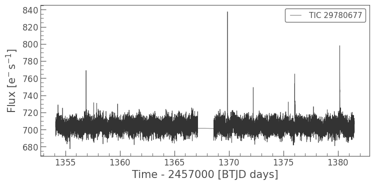
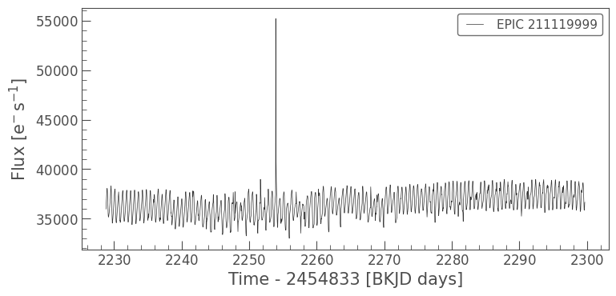

Finding Data
=====

There are several ways to create a ``FlareLightCurve`` in **AltaiPony**. For a quickstart, all you need is your target's TIC, EPIC or KIC (and campaign, quarter, or sector). Local TESS, Kepler and K2 light curves can be read with ``from_path``, but you can can also query MAST with ``fom_mast``. You can read in a light curve directly or convert a target pixel file. The latter is required if you want to use **k2sc** for de-trending. Familiarity with lightkurve_ is advantageous in any case.

Fetch a TESS light curve from MAST:

>>> from altaipony.lcio import from_mast
>>> flc = from_mast("TIC 29780677", mode="LC", mission="TESS", c=1)

Then, calling

>>> flc.plot()

will show

Or a K2 target pixel file, and convert it to a ``FlareLightCurve`` using some extra arguments like ``flux_type``, ``cadence``, and ``aperture_mask`` :

>>> flc = from_mast("EPIC 211119999", mode="TPF", mission="K2", c=4, flux_type="PDCSAP_FLUX", cadence="long", aperture_mask="default")
>>> flc.plot()

You can also fetch some remote file, de-trend it, store it as an AltaiPony light curve, and read it back in again, like so:

>>> flc = from_mast("TIC 358108509", mode="LC", mission="TESS", c=1)
>>> dflc = flc.detrend("savgol")
>>> dflc.to_fits("ponylc.fits")
>>> ...
>>> from altaipony.lcio import from_path
>>> rflc = from_path("ponylc.fits", mode="AltaiPony", mission="TESS")

.. module:: altaipony.lcio

.. automodapi:: altaipony.lcio
   :no-heading:
   :no-inherited-members:
   :no-inheritance-diagram:

.. _lightkurve: https://github.com/KeplerGO/lightkurve
 
   
